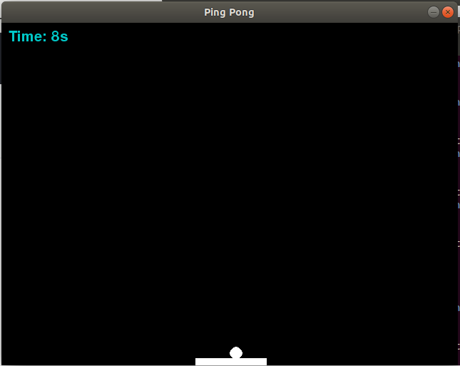

# Ping Pong

Jogo feito com python3 utilizando biblioteca pygame.

## Apresentação

- [Google Docs](https://docs.google.com/presentation/d/1otSEZynSSPI1zCDAzc50ZfjWrFwe4bryoBFrYPZFmDQ/edit?usp=sharing)
- [Vídeo Demonstrativo](https://youtu.be/a3WugDuuEsI)

## Prática

Vamos precisar instalar:

* [Python](https://www.python.org/downloads)
* [Pygame](https://www.pygame.org/download.shtml)

### Passos

1. [Criar tela, retângulo e tempo de jogo.](src/passo-1.py)
2. [Mover retângulo e colocar música.](src/passo-2.pdf)
3. [Menus finals.](src/passo-3.pdf)
4. [Criar e mover bola.](src/passo-4.pdf)

* RUN python: python3 nome-arquivo.py
* IDE usada: [Atom](https://atom.io/)

## Criadores

**Jonathan Cardoso**

- <https://www.linkedin.com/in/jonathanccardoso/>
- <https://github.com/jonathanccardoso>

**Licia Jemima**

- <https://github.com/Jemimalicia>
